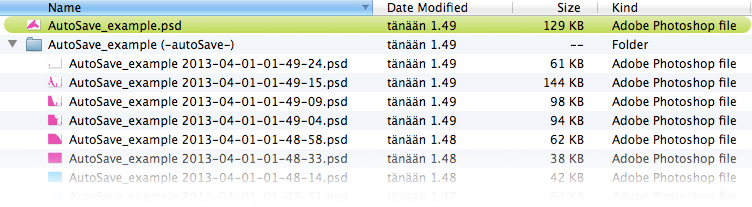
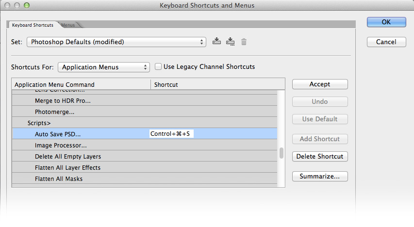

# Auto Save PSD script for Photoshop

You can define a keyboard shortcut that will not only save your file, but an additional `.psd` file as well.

This comes in handy if you feel like doing something new. Just press the shortcut key and continue working on the new design. If you feel like going back to the older design, the file can be found next to the original in a folder.

## Install

* **Download the files**: `Auto Save PSD.jsx` and `Auto Save PSD.atn`
* **Auto Save PSD.jsx**: Put this file in `{Photoshop_root}\Presets\Scripts\Auto Save PSD.jsx`
  * Next time you open photoshop you will find the script in: `File > Scripts > Auto Save PSD...`. If photoshop is already running, restart it.
* **Auto Save PSD.atn**: Double click this file so that it is added to photoshop.
  * You can make sure that it was added by going to: `Window > Actions` and making sure that you an find `Auto Save PSD` folder at the bottom of your Actions panel.
* **Add a shortcut in photoshop**:
  * `Edit > Keyboard shortcuts...` ( Mac: `Alt + Shift + Cmd + K`. Windows: `Alt + Shift + Ctrl + K` )
    * Choose `Shortcuts for: [Applications menus]`
    * `File > Scripts > Auto Save PSD`. ( After opening `File` you need to scroll down quite a bit to find `Scripts` ) 
* **Install complete**

## Things you should know

* The script has been tested in Photoshop cs3 and cs6 in Mac os x 10.8.3
* A document needs to be open for the script to do anything.
* Depending on the situation you might want to save a new file by using the script, so that the very first save will also be saved separately.
* The script will find the required Photoshop Action (`Auto Save PSD.atn`) automatically when needed, as long as you've added it into photoshop.
* The Action is used to run a normal `save` command to prompt a `save as dialog` when you are doing the first file save with the script.
* Although setting up a keyboard shotcut is highly recommended, you can still run the script from: `File > Scripts > Auto Save PSD...`.
 * The shortcut you've set in `Keyboard shortcuts...` will be shown in the menu path shown above. So if you forget it, that might be easiest way to find out what it is.
* The new file name system saves incremental numbers before the `.psd extension.

## Possible changes?
* Scripting functionality that enables me to get rid of the Action file. It's not super cumbersome to *install*, but I'd rather get rid of it.
* Name change to something more fitting.
