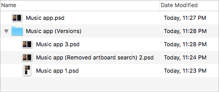
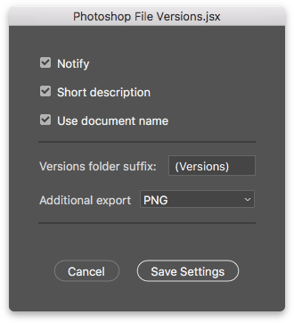

# Photoshop file versions script

Save an additional file version using a shortcut.

A quick video on using the script: https://youtu.be/Kvi7keEh_80 (No audio - _I'll make a better video one of these days_)




_The naming format shown in the image is outdated... I should change it. It does get the point across though_


## How it works

The script saves the `.psd` file twice. First, it saves the work file, just like you would using `File > Save` and then it saves another file next to that in a folder: "Your Photoshop Document.psd (Versions)".

This allows you to keep working just like you normally would and then run the script whenever you feel you have something you want to keep and perhaps try something different.

## Settings Dialog (since v.1.8.)

You can open the settings dialog by running the script with no documents open. When you're done with the settings, click the `Save Settings` button, open your file and start using it with the new settings.



Alternatively you can find the settings at the top of the `Photoshop File Versions.jsx` file.

> If the script folder contains `Photoshop File Versions.json`, the settings saved in that file will be used instead. You can reset the settings to whatever is in the `.jsx` file by trashing the `.json` file.

| Variable               | Type    | Description                                                                                                            |
|------------------------|---------|------------------------------------------------------------------------------------------------------------------------|
| **notify**             | Boolean | Optional alert that shows the name of the saved file on save. This helps make a mental note of which version is which. |
| **shortDescription**   | Boolean | Optional prompt for adding a small description in the filename. I would recommend 3-5 words max. You can always cancel the description or leave the description empty.                      |
| **useDocName**         | Boolean | Use document name in the version filename.                                                                            |
| **versionsFolderName** | String  | This is a suffix for the versions folder: "My Document.psd (Versions)".                                                |
| **additionalExport**   | Boolean/String| Accepted values: false, 'jpg', 'png' (default: false)

## File name examples

**Minimal filename:**

Options:
```
var useDocName = false;
var shortDescription = false;
```
<sup><sub>Or you can have `shortDescription` on and just skip writing the description</sub></sup>

File version names:
```
v1.psd
v2.psd
v3.psd
```

**With just the description:**

Options:
```
var useDocName = false;
var shortDescription = true;
```

File version names:
```
v1 - Added a smudge.psd
v2 - Changed colors.psd
v3 - Contemplated existence.psd
```

**With the description and document name:**

Options:
```
var useDocName = true;
var shortDescription = true;
```

File version names:
```
v1 - My Document 2019 (Added a smudge).psd
v2 - My Document 2019 (Changed colors).psd
v3 - My Document 2019 (Contemplated existence).psd
```

**With the document name only:**

Options:
```
var useDocName = true;
var shortDescription = false;
```
<sup><sub>Or you can have `shortDescription` on and just skip writing the description</sub></sup>

File version names:
```
v1 - My Document 2019.psd
v2 - My Document 2019.psd
v3 - My Document 2019.psd
```

## Things you should know

* Version 1.5. tested in Photoshop CC 2019
   * Older versions were tested in CS3 and later on CS6, but at this point so many changes have been made that I can't guarantee it works in older versions. I would assume it works in CS6.
* You can always just press enter when you get the description prompt if you don't feel like adding one.
* If you forget the shortcut you set in Photoshop, you can check it at `File > Scripts > Photoshop File Versions`
* Previous name was: Auto Save PSD.jsx but this new name seems more fitting as it's less about automatic saving and more about intentionally saving file versions.

## How to use

You can just open the `.jsx` file in Photoshop to run it or alternatively, you can set a shortcut to run it, which is recommended.

**Set shortcut natively**

1. Put `Photoshop File Versions.jsx` in PS Scripts folder.
   - You can find it in the Photoshop install folder. For example (Mac): `/Applications/Adobe Photoshop CC 2019/Presets/Scripts`.
2. Restart Photoshop
3. Add the shortcut in `Edit > Keyboard shortcuts...`
   * Choose `Shortcuts for: [Applications menus]`
   * Find `File > Scripts > Photoshop File Versions`
   * [Add a shortcut](readme_img/Shortcut.png) (something like `Cmd+Ctrl+S`), then press `Accept` and `Ok`.
     
> It is possible to set the script to run every time you save a document with the native shortcuts, but I would not recommend that because then you would obviously be saving extra versions every single time you save. It makes more sense to only save the new version when you feel you got something worth keeping.
     
**Set shortcut with 3rd party applications**

Third party applications are a great way to offer different ways to trigger scripts as well as sync scripts from computer to computer. Read more about that here: https://graphicdesign.stackexchange.com/a/63446/2332 - This post is about Illustrator but applies to Photoshop as well.
